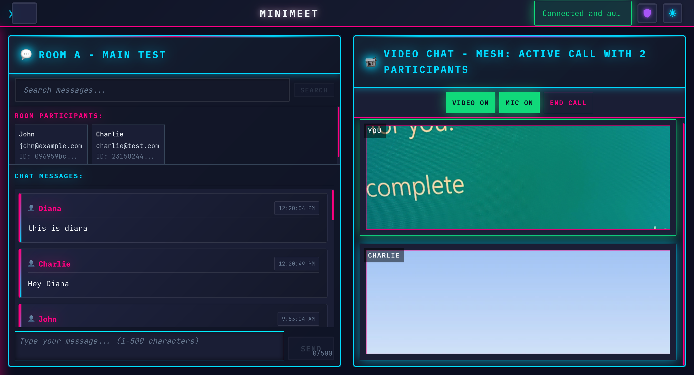
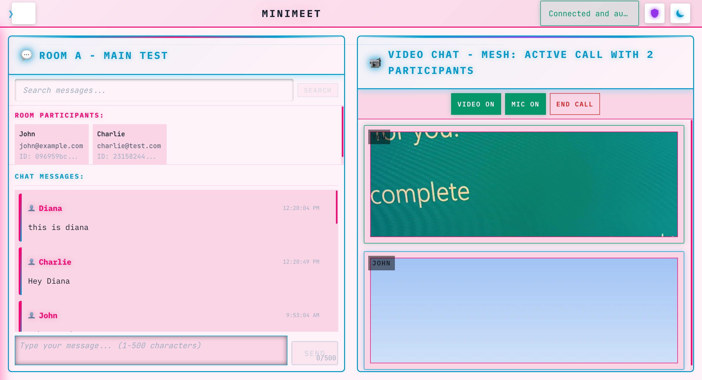

# MiniMeet

Multi-User Video Chat Application using NestJS, TypeScript, TypeORM, Socket.IO, WebRTC

## Overview

MiniMeet is a real-time video chat application that demonstrates modern web technologies for peer-to-peer communication. The application provides text chat, video calling, and room management capabilities through a responsive web interface.

## Current Status

 


### Implemented Features

- **Backend API**: NestJS with TypeORM and MySQL database integration
- **Authentication**: JWT-based authentication with WebSocket security guards
- **Real-Time Chat**: Socket.IO messaging with message persistence and validation
- **Video Communication**: WebRTC peer-to-peer video streaming with mesh topology
- **Frontend Interface**: React + TypeScript client with responsive design
- **Admin Panel**: Development tools for user and room management
- **Search Functionality**: User and room search with real-time filtering
- **Theme System**: Dark/light theme toggle with synthwave aesthetic

## Architecture

### System Components

**Backend Services**
- NestJS application server with modular architecture
- TypeORM for database operations and entity management
- Socket.IO gateway for real-time communication
- WebRTC signaling server for peer-to-peer connections
- JWT authentication with WebSocket security guards

**Frontend Application**
- React + TypeScript single-page application
- Socket.IO client for real-time updates
- WebRTC implementation for video streaming
- Responsive design with mobile support
- Theme system with dark/light mode toggle

**Data Storage**
- MySQL database for user accounts, rooms, and messages
- In-memory session management for active connections
- Message history persistence with search capabilities

## Features

### User Management
- JWT-based authentication system
- User registration and profile management
- Session management with automatic token refresh
- Admin panel for user administration (development mode)

### Room Management
- Create and join video chat rooms
- Real-time participant tracking
- Room search functionality
- Automatic cleanup of inactive rooms

### Communication
- Real-time text messaging with Socket.IO
- Message history persistence and retrieval
- Message search functionality
- WebRTC peer-to-peer video calls
- Mesh topology for multi-participant video
- Audio/video controls (mute, camera toggle)

### User Interface
- Responsive design for desktop and mobile
- Dark and light theme support
- Synthwave-inspired visual design
- Modal sidebar for in-room experience
- Real-time status indicators
- Search bars for users and rooms

## Technology Stack

### Backend
- **NestJS**: Application framework with dependency injection
- **TypeScript**: Type-safe development environment
- **TypeORM**: Database ORM with entity relationships
- **Socket.IO**: Real-time bidirectional communication
- **MySQL**: Relational database for data persistence
- **JWT**: Token-based authentication system
- **Class Validator**: DTO validation and sanitization

### Frontend
- **React**: Component-based user interface library
- **TypeScript**: Static type checking for JavaScript
- **Socket.IO Client**: Real-time communication with server
- **WebRTC**: Peer-to-peer video and audio streaming
- **CSS3**: Modern styling with custom properties
- **Responsive Design**: Mobile-first approach

### Development Tools
- **Docker Compose**: Containerized development environment
- **ESLint**: Code quality and consistency
- **Prettier**: Code formatting
- **Hot Reload**: Development server with live updates

## System Architecture

### Application Structure

```
┌─────────────────────┐    ┌─────────────────────────────┐
│   React Frontend    │    │      NestJS Backend         │
│                     │    │                             │
│  ┌───────────────┐  │    │  ┌─────────────────────────┐│
│  │ Chat Interface│  │◄──►│  │    Socket.IO Gateway    ││
│  └───────────────┘  │    │  │   (Real-time Events)    ││
│  ┌───────────────┐  │    │  └─────────────────────────┘│
│  │ Video Calling │  │◄──►│  ┌─────────────────────────┐│
│  └───────────────┘  │    │  │   WebRTC Signaling      ││
│  ┌───────────────┐  │    │  │    (Video Streams)      ││
│  │ Admin Panel   │  │◄──►│  └─────────────────────────┘│
│  └───────────────┘  │    │  ┌─────────┬─────────┬─────┐│
└─────────────────────┘    │  │  Auth   │  Rooms  │Msgs ││
                           │  │ Service │ Service │Svc  ││
                           │  └─────────┴─────────┴─────┘│
                           └─────────────────────────────┘
                                           │
                                  ┌────────▼────────┐
                                  │ MySQL Database  │
                                  │   (TypeORM)     │
                                  └─────────────────┘
```

### Data Flow

```
User Authentication:
Client → JWT Request → NestJS Auth → Database → JWT Token → Client

Real-time Chat:
Client → Socket.IO → Message Gateway → Database → Broadcast → All Clients

Video Calling:
Client A → WebRTC Offer → Signaling Server → Client B
Client B → WebRTC Answer → Signaling Server → Client A
Direct P2P Connection Established

Room Management:
Client → Join Room → Room Service → Database Update → Participant Broadcast
```

## Project Structure

### Backend (minimeet-server)

```
src/
├── auth/              # JWT authentication and WebSocket guards
├── users/             # User management and profiles
├── rooms/             # Room creation and participant management
├── messages/          # Chat messaging with persistence
├── video/             # WebRTC signaling gateway
├── webrtc/            # WebRTC connection management
├── search/            # Message and user search functionality
├── analytics/         # Usage analytics and monitoring
├── config/            # Application configuration
└── common/            # Shared utilities and guards
```

### Frontend (minimeet-client)

```
src/
├── components/        # React UI components
│   ├── AuthSection.tsx
│   ├── ChatRoom.tsx
│   ├── VideoChatMesh.tsx
│   ├── AdminPanel.tsx
│   ├── UserSearchBar.tsx
│   ├── RoomSearchBar.tsx
│   └── ThemeToggle.tsx
├── services/          # API and Socket.IO clients
├── hooks/             # Custom React hooks
├── types/             # TypeScript type definitions
├── style/             # CSS modules and themes
└── utils/             # Utility functions
```

### Database Schema

```
┌─────────────┐     ┌─────────────────┐     ┌─────────────┐
│    User     │     │ RoomParticipant │     │    Room     │
├─────────────┤     ├─────────────────┤     ├─────────────┤
│ id (PK)     │◄───►│ userId (FK)     │◄───►│ id (PK)     │
│ username    │     │ roomId (FK)     │     │ name        │
│ email       │     │ joinedAt        │     │ createdAt   │
│ createdAt   │     └─────────────────┘     │ maxUsers    │
└─────────────┘                             └─────────────┘
       │                                           │
       │                                           │
       ▼                                           ▼
┌─────────────┐                           ┌─────────────┐
│   Message   │                           │ CallSession │
├─────────────┤                           ├─────────────┤
│ id (PK)     │                           │ id (PK)     │
│ content     │                           │ roomId (FK) │
│ senderId(FK)│                           │ startedAt   │
│ roomId (FK) │                           │ endedAt     │
│ timestamp   │                           │ participants│
└─────────────┘                           └─────────────┘
```

### API Endpoints

**Authentication**
- `POST /auth/token` - Generate JWT token for user
- `GET /auth/validate` - Validate existing token

**Users**
- `GET /users` - List all users (admin)
- `POST /users` - Create new user (admin)
- `PUT /users/:id` - Update user (admin)
- `DELETE /users/:id` - Delete user (admin)

**Rooms**
- `GET /rooms` - List all rooms
- `POST /rooms` - Create new room (admin)
- `PUT /rooms/:id` - Update room (admin)
- `DELETE /rooms/:id` - Delete room (admin)

**Messages**
- `GET /messages/:roomId` - Get room message history
- `POST /messages/search` - Search messages by content

### WebSocket Events

**Room Management**
- `joinRoom` - Join a chat room
- `leaveRoom` - Leave current room
- `participantsUpdate` - Broadcast participant changes

**Messaging**
- `sendMessage` - Send chat message
- `newMessage` - Receive new messages
- `loadMessageHistory` - Load chat history
- `messageError` - Handle message validation errors

**WebRTC Signaling**
- `webrtc-offer` - Initiate video call
- `webrtc-answer` - Respond to video call
- `ice-candidate` - Exchange network information
- `call-ended` - Handle call termination

## Getting Started

### Prerequisites

- Node.js 16+ and npm
- MySQL 8.0+
- Modern web browser with WebRTC support

### Installation

1. Clone the repository
```bash
git clone <repository-url>
cd minimeet
```

2. Install dependencies
```bash
# Backend
cd minimeet-server
npm install

# Frontend
cd ../minimeet-client
npm install
```

3. Configure database
```bash
# Create MySQL database
mysql -u root -p
CREATE DATABASE minimeet;
```

4. Set environment variables
```bash
# minimeet-server/.env
DATABASE_HOST=localhost
DATABASE_PORT=3306
DATABASE_USERNAME=root
DATABASE_PASSWORD=your_password
DATABASE_NAME=minimeet
JWT_SECRET=your_jwt_secret
```

5. Start the application
```bash
# Start backend (from minimeet-server)
npm run start:dev

# Start frontend (from minimeet-client)
npm start
```

### Usage

1. **Authentication**: Enter a user ID and generate an authentication token
2. **Connection**: Connect to the server using the generated token
3. **Join Room**: Enter a room ID or search for existing rooms
4. **Chat**: Send and receive real-time messages
5. **Video Call**: Start video calls with other participants
6. **Admin Panel**: Access development tools (development mode only)

## Development

### Running Tests

```bash
# Backend tests
cd minimeet-server
npm run test

# Frontend tests
cd minimeet-client
npm test
```

### Building for Production

```bash
# Backend
cd minimeet-server
npm run build

# Frontend
cd minimeet-client
npm run build
```

### Docker Development

```bash
# Start all services
docker-compose up -d

# View logs
docker-compose logs -f

# Stop services
docker-compose down

# Rebuild containers
docker-compose up --build
```

### Environment Configuration

**Backend Environment Variables**
```bash
# Database Configuration
DATABASE_HOST=localhost
DATABASE_PORT=3306
DATABASE_USERNAME=root
DATABASE_PASSWORD=your_password
DATABASE_NAME=minimeet

# Authentication
JWT_SECRET=your_jwt_secret_key
JWT_EXPIRES_IN=24h

# Server Configuration
PORT=3001
CORS_ORIGIN=http://localhost:3000

# WebSocket Configuration
SOCKET_CORS_ORIGIN=http://localhost:3000
```

**Frontend Environment Variables**
```bash
# API Configuration
REACT_APP_API_URL=http://localhost:3001
REACT_APP_SOCKET_URL=http://localhost:3001

# Development Settings
REACT_APP_ENV=development
```

## Troubleshooting

### Common Issues

**Database Connection Errors**
- Verify MySQL is running and accessible
- Check database credentials in environment variables
- Ensure database exists and user has proper permissions

**WebRTC Connection Issues**
- Check browser WebRTC support (Chrome, Firefox, Safari recommended)
- Verify HTTPS is used in production (required for WebRTC)
- Check firewall settings for UDP traffic

**Socket.IO Connection Problems**
- Verify CORS configuration matches frontend URL
- Check network connectivity between client and server
- Ensure WebSocket support is enabled

**Authentication Failures**
- Verify JWT secret is consistent between requests
- Check token expiration settings
- Ensure proper token format in Authorization header

### Performance Optimization

**Database Performance**
- Add indexes on frequently queried columns
- Implement connection pooling
- Consider read replicas for high traffic

**WebRTC Optimization**
- Implement TURN servers for NAT traversal
- Consider SFU architecture for large groups
- Optimize video quality based on bandwidth

**Frontend Performance**
- Implement lazy loading for components
- Use React.memo for expensive components
- Optimize bundle size with code splitting

## Deployment

### Production Deployment

**Backend Deployment**
```bash
# Build the application
npm run build

# Start production server
npm run start:prod

# Or use PM2 for process management
pm2 start dist/main.js --name minimeet-server
```

**Frontend Deployment**
```bash
# Build for production
npm run build

# Serve static files (using nginx, apache, or CDN)
# Build output is in the 'build' directory
```

**Database Setup**
```sql
-- Production database setup
CREATE DATABASE minimeet_prod;
CREATE USER 'minimeet'@'%' IDENTIFIED BY 'secure_password';
GRANT ALL PRIVILEGES ON minimeet_prod.* TO 'minimeet'@'%';
FLUSH PRIVILEGES;
```

### Docker Production

```yaml
# docker-compose.prod.yml
version: '3.8'
services:
  app:
    build: .
    ports:
      - "3001:3001"
    environment:
      - NODE_ENV=production
      - DATABASE_HOST=db
    depends_on:
      - db
  
  db:
    image: mysql:8.0
    environment:
      MYSQL_ROOT_PASSWORD: secure_password
      MYSQL_DATABASE: minimeet_prod
    volumes:
      - mysql_data:/var/lib/mysql

volumes:
  mysql_data:
```

### Security Considerations

**Production Security Checklist**
- [ ] Use HTTPS for all communications
- [ ] Implement rate limiting on API endpoints
- [ ] Validate and sanitize all user inputs
- [ ] Use secure JWT secrets (256-bit minimum)
- [ ] Enable CORS only for trusted domains
- [ ] Implement proper error handling (no sensitive data exposure)
- [ ] Use environment variables for all secrets
- [ ] Enable database SSL connections
- [ ] Implement proper logging and monitoring
- [ ] Regular security updates for dependencies

## Monitoring and Analytics

### Application Metrics

The application includes basic analytics tracking:
- User registration and authentication events
- Room creation and participation metrics
- Message volume and frequency
- Video call duration and quality metrics

### Health Checks

```bash
# Check server health
curl http://localhost:3001/health

# Check database connection
curl http://localhost:3001/health/db

# Check WebSocket connectivity
curl http://localhost:3001/health/socket
```

### Logging

Application logs include:
- Authentication events
- Room join/leave activities
- Message sending/receiving
- WebRTC connection establishment
- Error tracking and debugging information

## Roadmap

### Planned Features

**Short Term**
- File sharing in chat rooms
- Screen sharing capabilities
- Message reactions and threading
- User presence indicators
- Mobile app development

**Medium Term**
- SFU implementation for larger groups
- Recording and playback functionality
- Advanced admin dashboard
- Integration with external authentication providers
- API rate limiting and quotas

**Long Term**
- Horizontal scaling with Redis
- Advanced analytics dashboard
- Plugin system for extensions
- Enterprise features (SSO, compliance)
- AI-powered features (transcription, translation)
